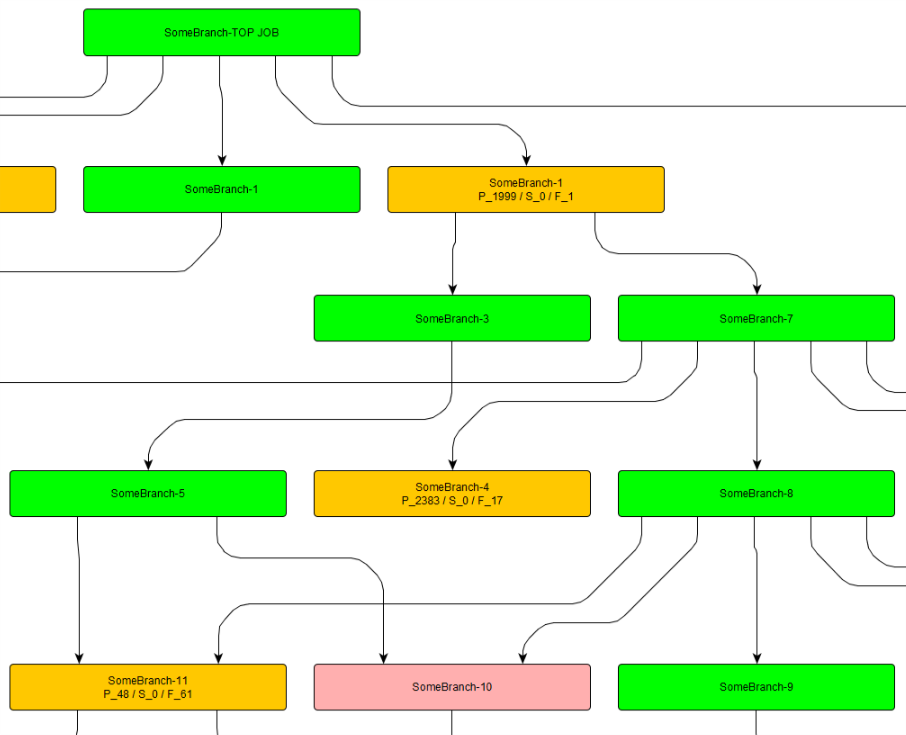

# Jenkins - View - Visualizer
`A fancy way to visualize Jenkins build progress, for example:`

### Allows you to see:

| Status   | Color       | Comment                                                   |
| -------- | ----------- | --------------------------------------------------------- |
| Passed   | green       | Passed Job                                                |
| Unstable | yellow      | with count of passed, failed & skipped tests              |
| Failed   | red         | Failed job                                                |
| Skipped  | pinkish-red | jobs that had duration less then TIMEOUT seconds, skipped |
| Not run  | gray        | jobs that were executed before TOP job                    |

# Usage

### Configuring application
Since tool is using `owner` library you can use either of ways to setting variables below.
1) Environment variables (as jenkins build params)
2) Pass JVM argument, for example `-DJENKINS_PASS=password`

### Params to be set:
* JENKINS_HOST
* JENKINS_USER
* JENKINS_PASS
* JENKINS_BRANCH_TOP_JOB_NAME
* JENKINS_GRAPH_LOCATION
* SKIPPED_TIME_SEC (optional)

Build will start on server `JENKINS_HOST` with user `JENKINS_USER` & Password/Secret `JENKINS_PASS`.

It will build branch `JENKINS_BRANCH` starting from Top job and will generate .graphml file at specified `JENKINS_GRAPH_LOCATION`.

If job duration is less then `SKIPPED_TIME_SEC` it is skipped.

# Running application
1) Run provided .jar file with `java -jar jenkins-flow-visualiser-0.4.0-jar-with-dependencies.jar`
2) Visualize generated `.graphml` file with yED tool. (Layout -> Hierarchical)

# Dependencies
This tool uses:

* [`vivosys osgi` code for visualization](https://github.com/vivosys/osgi-deps-graph)
* com.offbytwo.jenkins for jenkins api support
* org.sl4j as dependency for jenkins lib
* [`Owner` for configuration handling](http://owner.aeonbits.org)